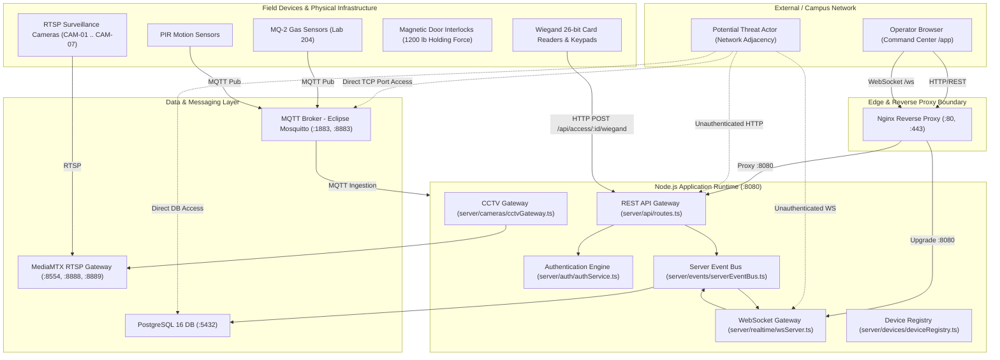

# Smart Campus Security & Automation — Architecture & Reconnaissance Report
**Audit Phase**: Phase 1 — Reconnaissance & Threat Modeling
**Target Repository**: Smart Campus Security & Automation Platform
**Target Version / Commit**: Phase 4/5 Commissioned Baseline (`a744ba5` frozen master)
**Date**: October 4, 2026
**Auditor**: Cloudflare Security Audit Engine (Defensive Source Analysis)

---

## 1. Executive System Topology

The Smart Campus Security & Automation platform is an integrated cyber-physical management system combining facility safety, real-time access control, environmental telemetry, and surveillance monitoring across campus zones.

---

## 2. Attack Surfaces & Entry Points

### 2.1 Public & Network HTTP Endpoints
| Endpoint | Method | Expected Role | Auth Required | File & Handler |
| :--- | :--- | :--- | :--- | :--- |
| `/health` | GET | Public | No | `server/api/routes.ts#L117` |
| `/health/components` | GET | Public | No | `server/api/routes.ts#L137` |
| `/api/auth/login` | POST | Public | No (Rate-limited) | `server/api/routes.ts#L149` |
| `/api/auth/logout` | POST | Authenticated | Yes (Session Token) | `server/api/routes.ts#L180` |
| `/api/auth/me` | GET | Authenticated | Yes (Session Token) | `server/api/routes.ts#L188` |
| `/api/state` | GET | All / Public | **NO** (Token Optional) | `server/api/routes.ts#L200` |
| `/api/zones` | GET | Public | **NO** | `server/api/routes.ts#L226` |
| `/api/zones/:id/lockdown`| POST | Admin / Security | Yes (RBAC checked) | `server/api/routes.ts#L231` |
| `/api/devices` | GET | Public | **NO** | `server/api/routes.ts#L287` |
| `/api/devices/:id` | GET | Public | **NO** | `server/api/routes.ts#L292` |
| `/api/cameras` | GET | Public | **NO** | `server/api/routes.ts#L305` |
| `/api/cameras/:id/ptz` | POST | Admin / Security | Yes (RBAC checked) | `server/api/routes.ts#L310` |
| `/api/cameras/:id/snapshot` | POST | Admin / Security / Staff | Yes (RBAC checked) | `server/api/routes.ts#L345` |
| `/api/sensors` | GET | Public | **NO** | `server/api/routes.ts#L366` |
| `/api/sensors/:id/reading` | POST | Hardware / Gateway | **NO (Open POST)** | `server/api/routes.ts#L371` |
| `/api/access` | GET | Public | **NO** | `server/api/routes.ts#L412` |
| `/api/access/:id/wiegand` | POST | Hardware / Reader | **NO (Open POST)** | `server/api/routes.ts#L418` |
| `/api/access/:id/pin` | POST | Hardware / Keypad | **NO (Open POST)** | `server/api/routes.ts#L477` |
| `/api/access/:id/override`| POST | Admin / Security | Yes (RBAC checked) | `server/api/routes.ts#L550` |
| `/api/incidents` | GET | Public | **NO** | `server/api/routes.ts#L593` |
| `/api/incidents` | POST | Staff / Security / Admin| Yes (RBAC checked) | `server/api/routes.ts#L598` |
| `/api/incidents/:id/acknowledge` | POST | Security / Admin | Yes (RBAC checked) | `server/api/routes.ts#L649` |
| `/api/incidents/:id/investigate` | POST | Security / Admin | Yes (RBAC checked) | `server/api/routes.ts#L682` |
| `/api/incidents/:id/resolve` | POST | Security / Admin | Yes (RBAC checked) | `server/api/routes.ts#L715` |
| `/api/audit` | GET | Admin / Security | Yes (RBAC checked) | `server/api/routes.ts#L756` |

### 2.2 WebSocket Gateway Surfaces (`/ws`, `/campus-events`)
- **Protocol**: Raw RFC 6455 WebSockets over HTTP Upgrade (`server/realtime/wsServer.ts`)
- **Ingress Message Channels**: `ws.on('message')` accepts JSON strings:
  - `{"type":"PING"}` -> responds with `{"type":"PONG"}`
  - Arbitrary JSON events -> filtered only for `ZONE_LOCKDOWN` and `ACCESS_OVERRIDE`, then forwarded directly to `serverEventBus.processEvent()`!
- **Egress Message Channels**: Real-time broadcast of all `CampusNormalizedEvent` instances dispatched across the campus event bus. Filtered only for `AUDIT_RECORD` if client role is `student`.

### 2.3 Field MQTT Messaging Surfaces
- **Broker**: Eclipse Mosquitto on port `1883` (plaintext) and `8883` (TLS)
- **Hierarchy Subscription**: `campus/+/+/+` mapped to `campus/{zone}/{subsystem}/{device}`
- **Subsystem Handlers**:
  - `campus/{zone}/sensor/{device}`: Parses `ppm` (MQ-2) and `motion` (PIR)
  - `campus/{zone}/access/{device}`: Parses `granted`, `cardholder`, `reason`, `failedAttempts`
  - `campus/{zone}/energy/{device}`: Parses `powerKw`, `powerFactor`
  - `campus/{zone}/iot/{device}`: Parses status, battery, IP

### 2.4 Browser / Client-Side Trust Boundary
- **Client State Storage**: `localStorage` keys:
  - `campus_persistence_role_v1`: Client-controlled role string (`admin`, `security_officer`, `faculty`, `student`)
  - `campus_persistence_incidents_v1`: Cached incidents
  - `campus_persistence_audit_v1`: Cached audit records
- **Client-Side Authorizations**:
  - `authService.ts` evaluates permissions in browser memory.
  - Several UI buttons (e.g. `requestUnlockDoor` in `stateContext.tsx`) update React state and local storage without making an authoritative backend API call when operating in simulated mode.

---

## 3. Threat Model & Attacker Profiles

1. **Unauthenticated External Attacker**:
   - Location: Internet or untrusted campus Wi-Fi network with HTTP routing to port `8080` or `80`.
   - Capabilities: Can craft arbitrary HTTP requests, WebSocket frames, and exploit public routes.
   - Goals: Gain administrative access, disengage physical door locks, disable cameras, or access restricted facility telemetry.

2. **Authenticated Low-Privilege Insider (Student / Guest)**:
   - Location: On-campus user with valid student credentials or active session token.
   - Capabilities: Can authenticate to `/api/auth/login`, connect to WebSocket, inspect frontend state.
   - Goals: Privilege escalation to Security Officer or Administrator; override facility access controls; dismiss active incident alarms.

3. **Adjacent Network / IoT Field Device Attacker**:
   - Location: Network segment adjacent to field controllers, CCTV cameras, or MQTT broker (ports `1883`, `8554`).
   - Capabilities: Can inject rogue MQTT packets, forge Wiegand card-reader transmissions, or intercept RTSP video streams.
   - Goals: Spoof toxic gas sensor alerts, force building evacuation, harvest unencrypted physical access credentials.
